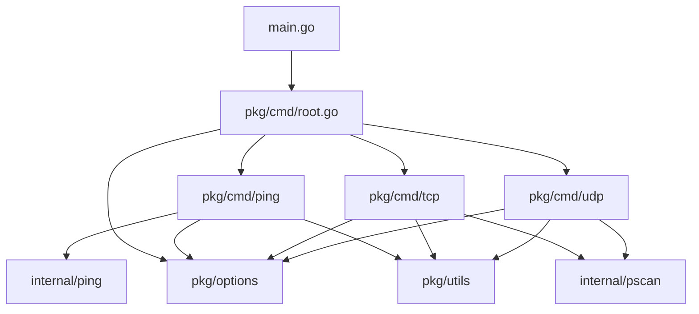
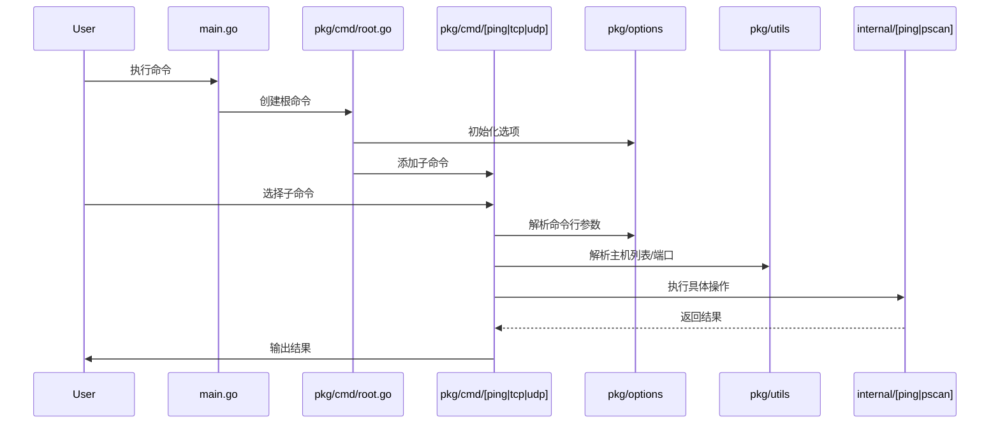
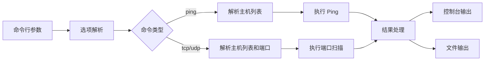

# Net-Sniff

网络探测工具，支持批量 Ping 和 TCP/UDP 端口扫描。

## 功能特点

- 批量 Ping 主机
- TCP 端口扫描
- UDP 端口扫描
- 支持从文件读取主机列表
- 支持指定端口范围
- 支持并发扫描
- 支持输出结果到文件


------

## 目录结构

```
net-sniff/
├── main.go                # 主程序入口
├── pkg/
│   ├── cmd/               # 命令行处理
│   │   ├── root.go        # 根命令
│   │   ├── ping/          # ping 子命令
│   │   ├── tcp/           # tcp 子命令
│   │   └── udp/           # udp 子命令
│   ├── options/           # 配置选项
│   └── utils/             # 工具函数
├── internal/              # 内部实现
│   ├── ping/              # ping 实现
│   └── pscan/             # 端口扫描实现
```


------

## 架构设计

### 架构图



### 序列图




### 数据流



------

## 使用示例

```bash
# 批量 Ping
net-sniff ping -H 192.168.1.1,192.168.1.2 -v

# 使用 CIDR 格式扫描网段
net-sniff ping -H 192.168.1.0/24 -v

# 对整个网段进行 TCP 扫描
net-sniff tcp -H 192.168.1.0/24 -p 80,443 -v

# TCP 端口扫描
net-sniff tcp -H 192.168.1.1 -p 80,443,8000-8100 -v

# UDP 端口扫描
net-sniff udp -H 192.168.1.1 -p 53,123,161 -v

# 从文件读取主机列表
net-sniff ping -H hosts.txt -v

# 输出到文件
net-sniff tcp -H 192.168.1.1 -p 80,443 -o results.csv

```


------

## 安装

### 从源码安装

```bash
# 克隆仓库
git clone https://github.com/ezra-sullivan/net-sniff.git
cd net-sniff

# 构建
go build -o net-sniff.exe

# 安装
go install
```

### 使用 Go Get

```bash
go get github.com/ezra-sullivan/net-sniff
```


------

## 配置选项

| 选项 | 简写 | 描述 | 默认值 |
|------|------|------|--------|
| --hosts | -H | 主机列表，逗号分隔或文件路径 | - |
| --ports | -p | 端口列表，逗号分隔或范围 | - |
| --concurrency | -c | 并发数 | 100 |
| --timeout | -t | 超时时间（毫秒） | 1000 |
| --output | -o | 输出文件路径 | - |
| --verbose | -v | 显示详细信息 | false |
| --log-level | -l | 日志级别: debug, info, warn, error | info |


------

## 贡献指南

1. Fork 本仓库
2. 创建您的特性分支 (`git checkout -b feature/amazing-feature`)
3. 提交您的更改 (`git commit -m 'Add some amazing feature'`)
4. 推送到分支 (`git push origin feature/amazing-feature`)
5. 打开一个 Pull Request


------

## 许可证

本项目采用 MIT 许可证。

MIT 许可证是一种宽松的软件许可证，它基本上允许任何人以任何方式使用您的代码，只要他们在自己的项目中包含原始许可证和版权声明。

### 许可证摘要

- 可以自由使用、复制、修改、合并、发布、分发、再许可和/或出售本软件的副本
- 必须在所有副本或实质性部分中包含上述版权声明和本许可声明
- 本软件按"原样"提供，不提供任何形式的明示或暗示的保证

完整的许可证文本请参见项目根目录下的 [LICENSE](LICENSE) 文件。

